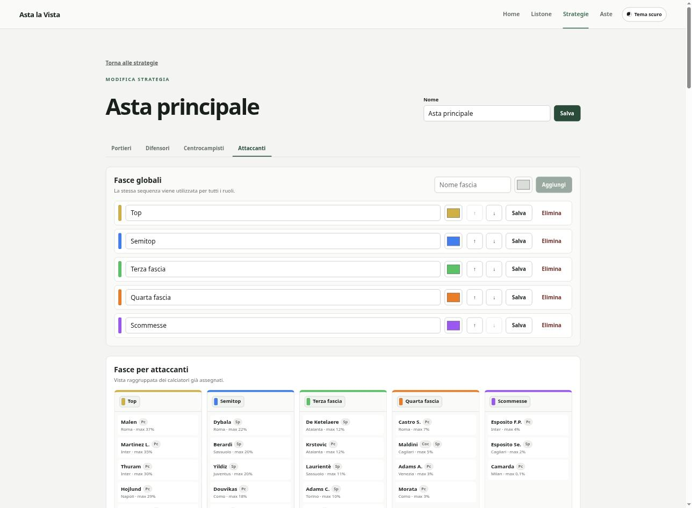
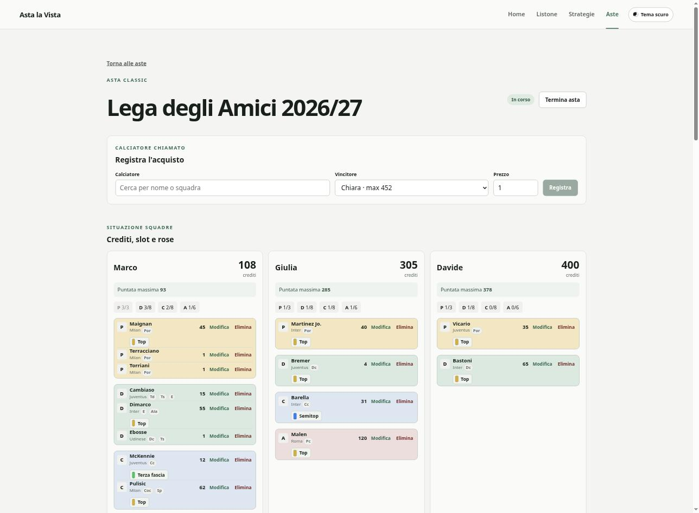
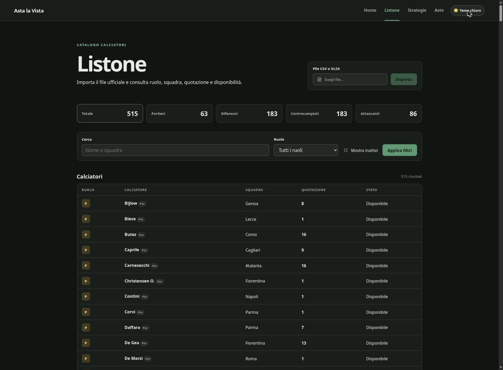

# Asta la Vista

[](https://github.com/fedeRizzi04/asta-la-vista/actions/workflows/backend.yml)
[](LICENSE)
[](backend/pyproject.toml)
[](frontend/package.json)
[](frontend/package.json)

Asta la Vista è una web app pensata per assisterti durante l'asta del fantacalcio (per ora viene supportata solamente la modalità Classic). È possibile caricare un listone in formato _.csv_ o _.xlsx_ contenente i giocatori (con relativi ruoli e squadre) e da lì gestire l'intera asta senza più bisogno di fogli Excel o carta e penna.

## Cosa puoi fare

- **Listone** — importa il file ufficiale di fantacalcio.it e tieni sotto controllo ruolo, squadra, quotazione e disponibilità di ogni calciatore.
- **Strategie** — crea fasce globali personalizzate (colore, ordine, percentuale massima di spesa) e assegna i calciatori di ogni ruolo, per sapere sempre a colpo d'occhio chi prendere e a che prezzo.
- **Aste live** — segui in tempo reale crediti residui, slot liberi e rosa di ogni partecipante mentre registri gli acquisti, con le fasce sempre visibili per capire chi è già stato preso. Inoltre è presente una visuale a 360 gradi su ogni ruolo, utile per capire i giocatori già presi e quelli ancora possibili da chiamare.
- **Resoconto finale** — scarica un riepilogo HTML dell'asta al termine, apribile con qualsiasi browser, senza bisogno di server o connessione.

<p align="center">
  
  
</p>

C'è anche un tema scuro, utile per aste che si inoltrano troppo tardi (ne sappiamo qualcosa):

<p align="center">
  
</p>

## Motivazione

Il progetto nasce dal desiderio di provare a sviluppare interamente un'applicazione affidandosi ad un coding agent attraverso un lavoro di planning curato. Oltre a questo, durante le aste finalmente si potrà usare uno strumento gratuito e automatizzato, diverso dal solito foglio di carta o documento excel (talvolta anche quest'ultimo risulta a pagamento).

## Avviare l'applicazione

Il progetto può essere avviato con Docker oppure direttamente sulla propria macchina tramite Python e Node.js.

### Con Docker

È sufficiente avere Docker con il plugin Compose. Dalla cartella principale del progetto eseguire:

```bash
docker compose up --build
```

Al primo avvio Docker costruisce l'immagine, prepara il database e applica le migrazioni. Quando
l'applicazione è pronta, aprire `http://localhost:5000`. Gli avvii successivi possono essere eseguiti
con il solo `docker compose up`; dopo aver aggiornato il progetto è necessario aggiungere nuovamente
`--build` per ricostruire l'immagine.

Per utilizzare una porta diversa, per esempio la `8080`:

```bash
HOST_PORT=8080 docker compose up
```

Il database SQLite è conservato nel volume Docker `app-data`, quindi aste e strategie rimangono
disponibili anche dopo `docker compose down` o dopo la ricostruzione dell'immagine. Il comando
`docker compose down -v` elimina anche il volume e tutti i dati salvati.

### In locale

Per l'avvio locale servono:

- Python 3.12 o successivo
- [uv](https://docs.astral.sh/uv/)
- Node.js 24 o successivo

Dopo aver clonato il repository, installa il backend e crea la configurazione locale:

```bash
cd backend
cp .env.example .env
uv sync
uv run alembic upgrade head
```

Installa poi il frontend:

```bash
cd ../frontend
npm install
```

Il database SQLite verrà salvato nella cartella locale `backend/instance`, esclusa da Git.

Dopo la prima installazione è possibile preparare e avviare l'intera applicazione dalla cartella
principale con:

```bash
./bin/start
```

Lo script applica le migrazioni, installa le dipendenze mancanti e avvia backend e frontend.

#### Avvio manuale del backend

```bash
cd backend
uv run flask --app asta_la_vista.entrypoints.flask_app:create_app run --host 127.0.0.1
```

Il backend risponde su `http://127.0.0.1:5000`. L'endpoint di controllo è disponibile su
`http://127.0.0.1:5000/api/health`.

#### Avvio manuale del frontend

In un secondo terminale:

```bash
cd frontend
npm run dev
```

L'interfaccia è disponibile su `http://127.0.0.1:5173`. Durante lo sviluppo, le richieste a
`/api` vengono inoltrate automaticamente al backend Flask.

## Flusso dell'applicazione

1. Aprire la sezione Listone e importare il file CSV o XLSX con i calciatori. Per non avere problemi è preferibile utilizzare il file di [fantacalcio.it](https://www.fantacalcio.it/quotazioni-fantacalcio). 
2. Creare una o più strategie, definendo fasce globali con ordine e colori personalizzati e assegnando i calciatori alle fasce per ciascun ruolo. Per ogni calciatore si possono indicare una nota e una percentuale massima di spesa facoltative; durante l'asta la percentuale viene convertita in crediti usando il budget iniziale dell'asta.
3. Creare l'asta indicando crediti, slot, partecipanti ed eventualmente una strategia.
4. Avviare l'asta e registrare ogni acquisto. La schermata aggiorna crediti residui, puntata
   massima, slot e rosa di ogni partecipante. Il pannello calciatori permette di filtrare per
   ruolo, ordinare per fascia o quotazione e selezionare direttamente il prossimo calciatore da
   chiamare.
5. Al termine dell'asta scaricare il resoconto in formato HTML, apribile direttamente su Linux e
   macOS (anche su Windows per i più temerari) con qualsiasi browser.

## Verifiche

Eseguire i test backend:

```bash
cd backend
uv run pytest
```

Controllare stile ed errori statici:

```bash
uv run ruff check .
uv run ruff format --check .
```

Per controllare il frontend:

```bash
cd frontend
npm run check
npm run lint
npm run build
```
